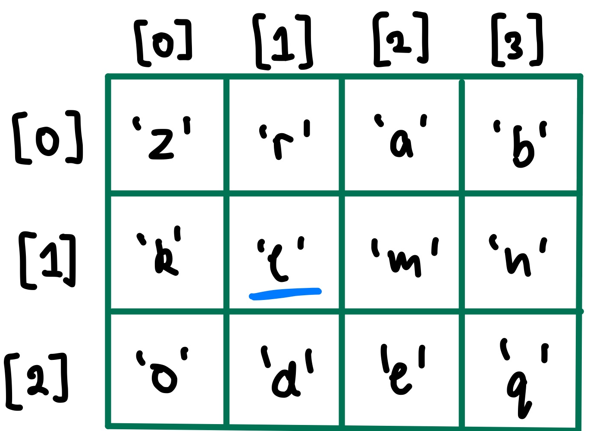

# Multidimensional Arrays

### ```char game_board[MAX_HEIGHT][MAX_WIDTH];```



How would we find the address of where the underlined variable is located?

```assembly
&gameboard[1][1] = &game_board + offset
								 = &game_board + MAX_WIDTH * 1 + 1 
								 
&game_board[x][y] = &game_board + (MAX_WIDTH * x + y) * sizeof(ELEMENT)
```


# Structs


In MIPS, it would look something like this:

```assembly
	# Constants
ZID_OFFSET = 0
FIRST_OFFSET = 4
LAST_OFFSET = 24
PROGRAM_OFFSET = 44
ALIAS_OFFSET = 48

main:
	...
	
	# Assuming the fields have been loaded for student1, how would you load the program 	     # field into register $t0?
	
	# Calculate the address of where program is stored
	la		$t0, student1
	add		$t0, $t0, PROGRAM_OFFSET
	lw		$t0, ($t0)		
	
	# Alternatively can be done in one line:
	lw		$t0, student1 + PROGRAM_OFFSET

	.data
student1:		.space 58
```


# Multi-function MIPS Program

```c
int sum(int value, int l) { // Non-leaf function, push/pop $ra $s
  
  	// To decide whether to use temporary or saved registers, think about if the variable needs to survive a function call
		int i, j, k;
  
  	i = 5;								// $t0, doesn't need to survive a function call
  	k = max(i, value); 		// $s0, needs to survive a function call
  	j = get_num();  			// $t1, doesn't need to survive a function call
  
  	return j + k;
}
```

```assembly
sum:
sum__prologue: # pushing
	push	$ra
	push	$s0
	
	move	$t9, $a0		# preserve int value

sum__body:
	li		$$t0, 5			# i = 5
	
	move	$a0, $t0		# a0 = i
	move	$a1, $t9		# a1 = value
	jal		max
	move	$s0, $v0		# k = max(i, value)
	
	jal		get_num
	move	$t1, $v0

sum__epilogue: 		# pop in opposite order
	pop		$s0
	pop		$ra 
	
	add		$v0, $s0, $t1
	jr		$ra				# return j + k
```

1. When translating to MIPS, what should we look out for when deciding which registers to use?

2. Do we need to push and pop anything? 

   Yes, to satisfy the MIPS calling convention, you must save and restore values in $s registers and $ra if they are overwritten.


